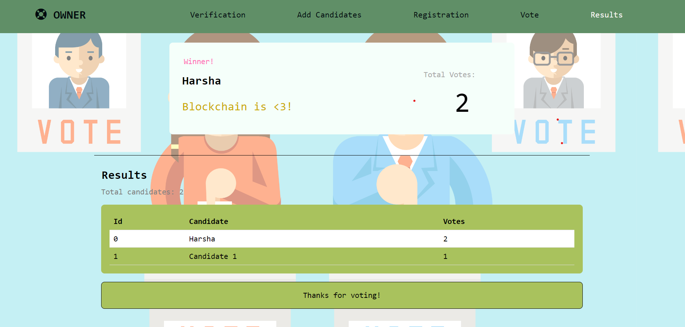
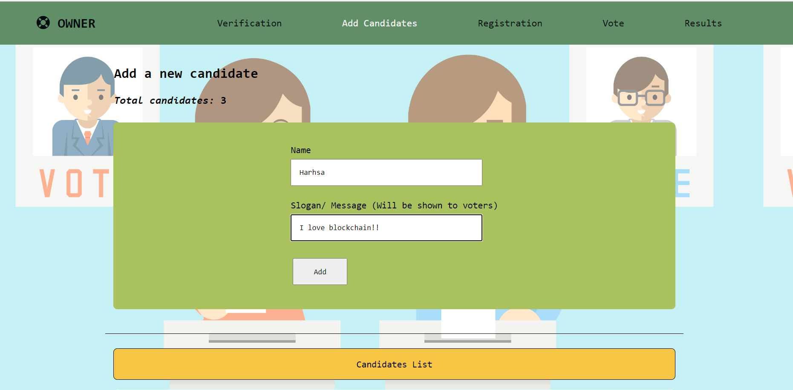

# Decentralized Voting


The project is based on developing a decentralized application (Dapp) for electoral polling
systems. It allows voters and administrators to organize voting in a decentralized manner
(without depending on a single administrative body). The electoral polling dapplication developed in this project is based on the ethereum blockchain
technology. 

## Tech Stack 
1. Frontend - CSS, JS
2. Backend - Node, Truffle 
3. Local Blockchain - Ganache, Metamask
4. Smart contracts - Solidity

## Configure code on your system

1. Clone the repo 

```
git clone https://github.com/pandeyanuradha/Decentralized-Voting-Website.git
cd Decentralized-Voting-Website
```

2. Run local Ethereum on Command Line Interface (CLI)

```
ganache-cli
```

3. Configure Metamask on your browser

New RPC URL: http://localhost:8545 <br />
Chain ID: 1337

4. Import accounts using Private keys from ganache-cli to Metamask
5. Deploy smart contract  
```
truffle migrate
````
6. Launch the development server
```
cd client
npm install
npm start
```

## Working of Decentralized Voting Website

1. Ganache workspace
 
<!-- 
 -->


2. Admin will create a voting instance by launching/deploying the system in a blockchain network (EVM), then create an election instance and start the election with the details of the election filled in (including candidates for voters to vote). On startup, the homepage is displayed.




 
